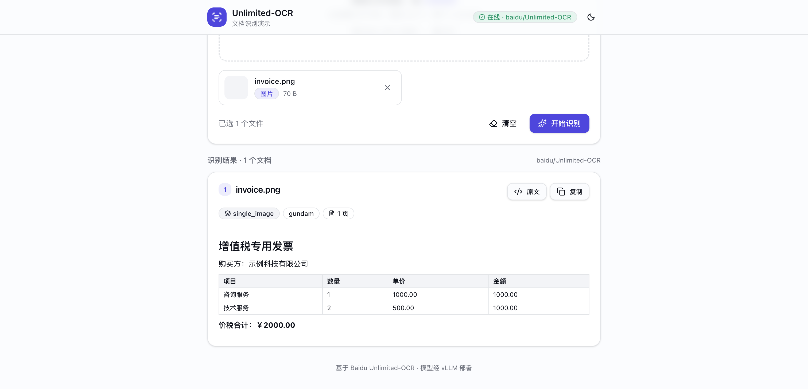

# Unlimited-OCR-FastAPI

[English](README.md) | **简体中文**

一个轻量级的 **FastAPI** 服务，使用百度
[Unlimited-OCR](https://huggingface.co/baidu/Unlimited-OCR) 模型把
**图片和 PDF 转换为文字**。

本服务**不**负责部署 OCR 模型本身。你需要自己用
**[vLLM](https://github.com/vllm-project/vllm)**（它提供 OpenAI 兼容 API）
来部署模型，本服务只负责调用它。vLLM 的地址、API Key 和模型名完全通过
**环境变量**传入。

请求格式严格遵循 Unlimited-OCR 官方的 vLLM 示例 —— 包括字面量 `<image>` 提示词
前缀、`skip_special_tokens=false`，以及通过 `vllm_xargs` 传入的 DeepSeek-OCR
no-repeat-ngram 参数（`ngram_size` / `window_size`）。

> **no-repeat-ngram logits processor 必须在 vLLM 服务端注册**（不会随每个请求发送）。
> 启动 vLLM 时加上
> `--logits_processors vllm.model_executor.models.unlimited_ocr:NGramPerReqLogitsProcessor`；
> 否则长文档会在 `<|det|>` 坐标 token 上循环。

## 各场景固定的提示词

提示词与采样参数均为**写死的**（不可由用户自定义），与官方用法保持一致：

| 场景      | 提示词                | `image_mode` | `ngram_size` | `window_size` |
| --------- | --------------------- | ------------ | ------------ | ------------- |
| 单张图片  | `document parsing.`   | `gundam`     | 35           | 128           |
| 多张图片  | `Multi page parsing.` | `base`       | 35           | 1024          |
| PDF       | `Multi page parsing.` | `base`       | 35           | 1024          |

vLLM 会自动选择图像模式：单张图片使用 `gundam`（crop）模式，多张图片 / PDF 自动
回退到 `base` 模式。`image_mode` 仅作为信息返回，不可由客户端指定。

## 接口

| 方法   | 路径         | 说明                                          |
| ------ | ------------ | --------------------------------------------- |
| GET    | `/health`    | 存活检查 + 当前模型 / vLLM 地址。              |
| POST   | `/ocr`       | 多张图片合并为一个文档；每个 PDF 各为一个文档。|
| POST   | `/ocr/image` | 单张图片 → 单页解析；多张 → 一个多页文档。     |
| POST   | `/ocr/pdf`   | 每个 PDF → 一个多页文档。                      |

Multipart 表单字段：

- `files`：一个或多个文件（多文件时重复该字段）。

交互式文档地址：`/docs`。

### 响应结构

```json
{
  "model": "baidu/Unlimited-OCR",
  "results": [
    {
      "name": "invoice.pdf",
      "scenario": "pdf",
      "image_mode": "base",
      "page_count": 2,
      "text": "…识别出的文字…",
      "error": null
    }
  ]
}
```

## 配置

所有配置均来自环境变量（参见 [`.env.example`](.env.example)）：

| 变量                   | 默认值                      | 说明                                                  |
| ---------------------- | --------------------------- | ----------------------------------------------------- |
| `VLLM_BASE_URL`        | `http://localhost:8000`     | vLLM 服务根地址（会自动追加 `/v1/chat/completions`）。 |
| `VLLM_API_KEY`         | *（空）*                    | Bearer Token；无鉴权时留空或填 `EMPTY`。              |
| `OCR_MODEL`            | `baidu/Unlimited-OCR`       | vLLM 中注册的模型名。                                 |
| `OCR_MAX_CONCURRENCY`  | `4`                         | 对 vLLM 的最大并发 OCR 调用数。                       |
| `OCR_REQUEST_TIMEOUT`  | `1200`                      | 单次请求超时时间（秒）。                              |
| `OCR_MAX_TOKENS`       | `8192`                      | 单次 OCR 调用生成的最大 token 数。                    |
| `PDF_DPI`              | `300`                       | PDF 页面栅格化的 DPI。                                |
| `MAX_FILE_SIZE_MB`     | `50`                        | 单文件大小上限（0 表示不限制）。                     |
| `MAX_FILES`            | `20`                        | 单次请求最大文件数（0 表示不限制）。                 |

## 快速开始（Docker Compose）

1. 先用 vLLM 在某个可访问的地址部署模型，例如使用专用的发布镜像（该架构尚未进入
   稳定版 pip wheel）：

   ```bash
   docker run --rm --gpus all --network host --ipc host \
     vllm/vllm-openai:unlimited-ocr \
     baidu/Unlimited-OCR \
     --trust-remote-code \
     --logits_processors vllm.model_executor.models.unlimited_ocr:NGramPerReqLogitsProcessor \
     --no-enable-prefix-caching \
     --mm-processor-cache-gb 0
   ```

2. 让本服务指向它并启动：

   ```bash
   cp .env.example .env       # 修改 VLLM_BASE_URL / VLLM_API_KEY / OCR_MODEL
   docker compose up --build
   ```

   默认情况下它会指向 `http://host.docker.internal:8000`，以访问宿主机上运行的
   vLLM 服务。

3. 服务现在运行在 `http://localhost:8000`（文档地址 `/docs`）。

## 快速开始（本地，不用 Docker）

```bash
python -m venv .venv && source .venv/bin/activate
pip install -r requirements.txt
export VLLM_BASE_URL=http://localhost:8000
export OCR_MODEL=baidu/Unlimited-OCR
uvicorn app.main:app --host 0.0.0.0 --port 8000
```

## 前端演示

[`web/`](web/) 目录是一个独立的浏览器演示应用：拖拽图片 / PDF 即可识别并查看渲染后
的 markdown。技术栈为 **Vite · React · TypeScript · TailwindCSS v4 · shadcn/ui ·
lucide-react**。



功能：

- 拖拽 / 点击上传，客户端校验镜像后端限制（≤ 20 个文件、单个 ≤ 50 MB）。
- 调用统一的 `POST /ocr` 接口，忠实反映其语义（多张图片合并为一个多页文档，每个
  PDF 各自独立）。
- 结果渲染为 markdown（标题、表格、列表）。默认清洗 grounding token
  （`<|ref|>` / `<|det|>`），并提供「原文 / 清洗后」切换和复制按钮。
- 实时后端健康徽章、明暗主题。

```bash
cd web
pnpm install
pnpm dev        # http://localhost:5173（需要后端运行在 :8000）
```

后端需通过 CORS 允许前端来源（`CORS_ALLOW_ORIGINS`，默认 `*`）。详见
[`web/README.md`](web/README.md)。

## 使用示例

单张图片（gundam）：

```bash
curl -X POST http://localhost:8000/ocr/image -F "files=@page.jpg"
```

多张图片（一个多页文档）：

```bash
curl -X POST http://localhost:8000/ocr/image \
  -F "files=@page1.png" -F "files=@page2.png"
```

PDF（一个或多个）：

```bash
curl -X POST http://localhost:8000/ocr/pdf -F "files=@document.pdf"
```

## 说明

- 本服务**不进行任何模型部署**；它只负责处理上传、PDF 栅格化，并使用官方
  Unlimited-OCR 请求格式调用你的 vLLM 接口。
- no-repeat-ngram logits processor 在 vLLM 服务端注册，**不会**随每个请求发送 ——
  因此本服务无需依赖 sglang/torch。
- 请求在内部以流式方式从 vLLM 读取，并聚合为接口最终返回的文字。
